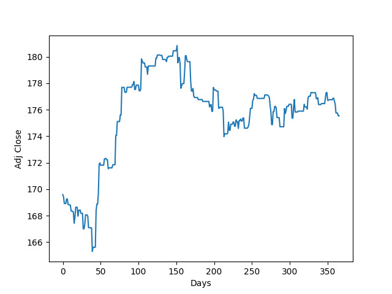

# MEIP
> Multivariate approach towards embedding and inference of ticker performance

 

**AAPL prediction**, YTD as of 2023-05-04. To reproduce, run: ``--infer "embedding=169.27999877929688,169.58999633789062,52472900,0.0018312710351440706,0.28674579694725333,-0.4767 days=365"``

 

# Research
## Abstract
The goal of this project is to explore and demonstrate a PoC of an approach to predicting ticker embeddings, as opposed to traditional time-series analysis which relies on single-values (generally day closes). Similar to NLP embeddings, ticker embeddings as explored in this project are a numerical representation of a ticker's metadata. This metadata includes, but is not limited to, sentiment, open, close, volatility, etc. The embeddings are then used to infer the performance of a ticker based on the performance of similar tickers. 

## Models
A multi-model approach is taken towards the embedding and inference of ticker performance. For sentiment analysis over time in particular, the NLTK Vader model is used. Ticker embeddings, in contrast to traditional word embeddings, are a numerical complitation of the ticker metadata. From there, a K Nearest Neighbors model is used to find the most similar tickers to a given ticker. This process closely mirrors vector-based search in NLP.

 

# Usage
While this repository is intended to be a simple PoC, it is also intended to be a template for future projects. As such, the project is structured in a way that allows for easy extension and modification. A Google Colab notebook is provided for ease of use [here](https://colab.research.google.com/drive/1ZfNHHZBpsqM7JHFNWPjgVhEKdp9tWQGN?usp=sharing).

For those who wish to run the project locally, the following steps are recommended:
1. Clone the repository
   ``git clone https://github.com/finned-tech/MEIP.git``
2. ``cd`` into the repository
   ``cd MEIP``
3. Install the dependencies
   ``pip install -r requirements.txt``
4. Run the project
   ``python main.py``

There are a few arguments that can be passed to the main script in order to process, train, and predict with the model locally. These arguments are as follows:
- ``--process``: Process the data
- ``--train``: Train the model
- ``--make-embedding ""``: Make an embedding for a given ticker, intended to be passed to the ``--infer`` argument, where headline is the news headline to be embedded, ticker is the ticker to be embedded, and date is the date of the headline's publish.   **Example:** ``--make-embedding "headline='<headline>' ticker=SPY date=<YYYY-MM-DD>"``
- ``--infer``: Infer the performance of a ticker based on the performance of similar tickers, over a specified period (in days). Note that you don't need to pass the ticker in this step: All the necessary information is encoded in the embedding.   **Example:** ``--infer "embedding=169.27999877929688,169.58999633789062,52472900,0.0018312710351440706,0.28674579694725333,-0.4767 days=365"``. The output will be saved to ``infer.png``.

## Configuration
The configuration file is located at ``model/hyperparams.py``. This file contains all of the modifiable hyperparameters for the model.

